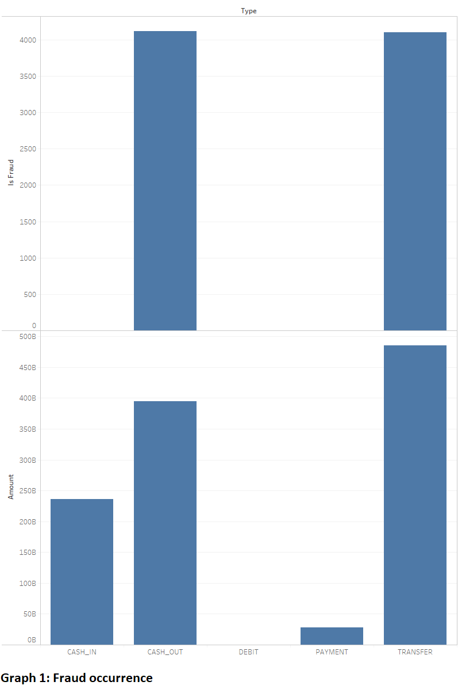

# Fraud Detection

In this blog, I will briefly define the traditional approach for fraud detection and discuss a alternative solution using machine learning.

## Out with the old, in with the new

Rule-based systems is the traditional approach for fraud detection. A rule-based system is a set of (IF 'condition' THEN 'do this'} statements that collectively imitate a machine learning model. Having a set of rules for flagging fraudulent transactions means the system will be inflexible and inevitably fail.  Some issues surrounding rule-based systems are as follows:

1. human error due to manually updating the ever evolving conditions
2. conditions may contradict with one another
3. the bad guys will find ways to innovate and circumvent the conditions

Fortunately, data science and machine learning techniques are seeing breakthrough due to enormously amounts of data, significantly improved algorithms, substantially more powerful computer hardware and an open community willing to share their knowledge.

## The data

Let's take a minute and talk about data, in general...

Either an organization has a lot of data, very little data or none at all.  

If an organization has a lot of data, datasets will be created from the aggregation of multiply data sources.  Before using the datasets, the data must be processed to remove duplicate records, correct labeling, etc...  GARBAGE IN = GARBAGE OUT

If an organization has very little data or none at all, synthetic dataset can be generated or sample datasets can be found online to be used as a base. As the organization accumulates more data, the synthetic dataset can be removed and machine learning model can be solely be trained on real data.

### Dataset

To train a machine learning model, sometime you will need three datasets, where the data is unique to each dataset.  The following is a suggested percentage and a brief description for each dataset:

```
	Train - 80% of your data - used to train your model
	Validation - 10% of your data - estimate how well your model has been trained 
	Test - 10% of your data - used model metrics (precision, recall and f-score)

	NOTE: To compare future models metrics, add upon these datasets
```

Now back to the main topic, I will use Synthetic Financial Datasets For Fraud Detection generated by the PaySim mobile money simulator to continue our discussion.

## Data analysis

Using a visualization tool, we find fraud only occurs in cash-out and transfer transactions.



Question: Are there records that are incorrectly label as not fraudulent or incorrectly label as fraudulent?

## Machine learning

Machine learning tasks are typically classified into two broad categories: supervised learning (the learning algorithm is presented with example inputs and its desired outputs.  The learning algorithm must find a general rule that maps inputs to outputs) and unsupervised learning (no labels are given to the learning algorithm and the learning algorithm must find structure in its input).

Fraud detection is typically handled as a binary classification task (for each transaction, either it is fraudulent or not fraudulent).  One might choose to use supervised learning as we have example inputs (transactions) and as its desired output (fraudulent or not fraudulent).  However, there are a couple of issues using supervised learning for fraud detection as follows:

1. incorrectly labeled classes: some transactions will be easy or next to impossible to identify and others will be indistinguishable to tell either way.  If transactions are incorrectly labeled, supervised learning predictions will be inaccurately.
2. fraudulent versus not fraudulent population is unbalanced: the fraudulent transactions are rare compared to the not fraudulent transactions.  If the class not fraudulent transactions is 99% of the population, supervised learning will probably predict not fraudulent transactions 99% of the time.

## Outlier detection using autoencoder

Autoencoder seems to be the favour of the month for fraud detection.  Autoencoder use neural networks to receive your input data and are trained to output that very same data. Autoencoder model optimize the parameters in such way that a special kind of error — reconstruction error is minimized. Outliers (fraudulent transactions) are identified as their reconstruction error is larger than the core of regular observations (not fraudulent transactions).

## Next steps...

In a future blog, we will train our autoencoder model using TensorFlow using a training dataset of not fraudulent transactions.  We will testing our model using a test dataset of fraudulent and not fraudulent transactions, where fraudulent transactions should be flagged.  Finally, we will deployment our model using docker.