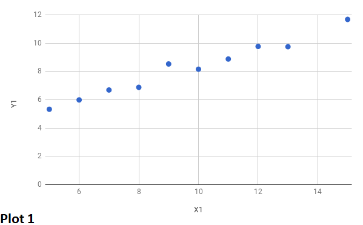
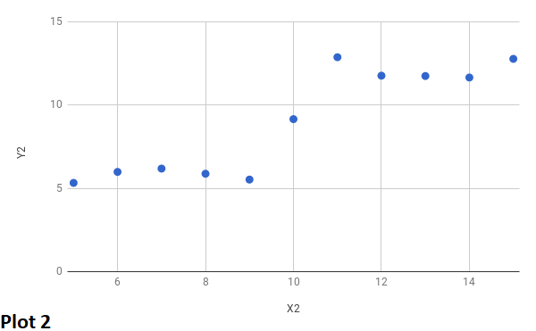

# Data Visualization

By Michael Yee

In this blog, I will discuss one of the most importance skills of a data scientist: data visualization.

## Part 1: The Data

The interpretation of data is seldom comprehensible by viewing columns and columns of numbers.  Data visualization bridges that gap and allows data scientist to communicate their analysis by transforming the data into visualization. 

Let us look at a simple example to understand our discussion...

Examine the following table showing columns with X1, Y1, X2 and Y2 values.  At first glace, one might assert that the Xs and Ys values seem equivalent.

| X1 | Y1 | X2 | Y2 | 
|----|-------|----|-------|
| 8 | 6.88 | 8 | 5.88 |
| 15 | 11.68 | 15 | 12.78 |
| 12 | 9.77 | 12 | 11.77 |
| 5 | 5.33 | 5 | 5.33 |
| 7 | 6.69 | 7 | 6.19 |
| 14 | 13.66 | 14 | 11.66 |
| 10 | 8.16 | 10 | 9.16 |
| 6 | 5.99 | 6 | 5.99 |
| 9 | 8.53 | 9 | 5.53 |
| 11 | 8.88 | 11 | 12.88 |
| 13 | 9.75 | 13 | 11.75 |

Let us examine X1 and Y1 verses X2 and Y2 by plotting the two and confirming our assertion.

As you can see, our assumption was far from correct as each plots tells a different story.  

## Part 2: Important Features of Data Visualization Software

Whether you are developing or using third party software tool, the software tool must have the following key features, as follows:

### Customizable Dashboards

Dashboards must be customizable to the target audience's real-time requirements.

    quick and easy process to instantly add or remove visualization
    intuitive process in arranging the visualization

### Reports

The software must have the ability to manipulate the relevant data (in countless different ways) to then be compiled into a quickly digestible report.  

### Real-Time

The ability to access the relevant data at anytime on any device.

## Summary

The visual representation of data is a skill that every data scientists must master in order to communicate information clearly, efficiently and visually appealing via plots, information and statistical graphics with their target audience.

## Coming Up...

In the next few weeks, I will be blogging upon paid and open source data visualization tools such as Tableau and Plotly.  These blogs will be a step by step guide from installation to creating your first dashboard and report.