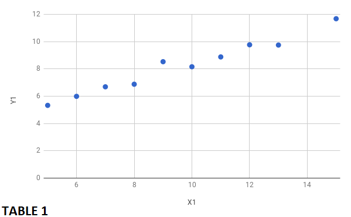
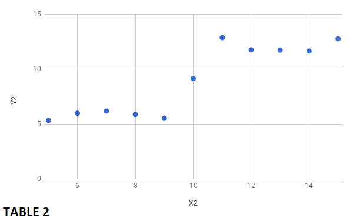

# Data Visualization

By Michael Yee

I this blog, I will discuss one of the most importance parts of data analysis: data visualization. The visual representation of data is a skill that every data scientists must master in order to communicate information clearly, efficiently and visually appealing via plots, information and statistical graphics with their target audience.  

## Part 1: The Data

The interpretation of data is seldom comprehensible by viewing columns and columns of numbers.  Data visualization bridges that gap and allows data scientist to communicate their data analysis by transforming the data into visualizations. 

Let us look at a simple example to understand our discussion...

Examine the following tables showing two columns with x and y values.  At first glace, one might assert that the x and y values in both tables seem equivalent.

| TABLE 1     |     | TABLE 2     |     
|-------------|     |-------------|     

| X1 | Y1 | X2 | Y2 | 
|----|-------|----|-------|
| 8 | 6.88 | 8 | 5.88 |
| 15 | 11.68 | 15 | 12.78 |
| 12 | 9.77 | 12 | 11.77 |
| 5 | 5.33 | 5 | 5.33 |
| 7 | 6.69 | 7 | 6.19 |
| 14 | 13.66 | 14 | 11.66 |
| 10 | 8.16 | 10 | 9.16 |
| 6 | 5.99 | 6 | 5.99 |
| 9 | 8.53 | 9 | 5.53 |
| 11 | 8.88 | 11 | 12.88 |
| 13 | 9.75 | 13 | 11.75 |

Let us examine the plot of the these two tables to confirm our assertion.

As you can see, our assumption was far from correct as both plots tells a different story.  

## Part 2: Important Features of Data Visualization

### Customizable Dashboards

### Data Mining

### Interactive Reporting

### Location Intelligence

### Real-Time Access 